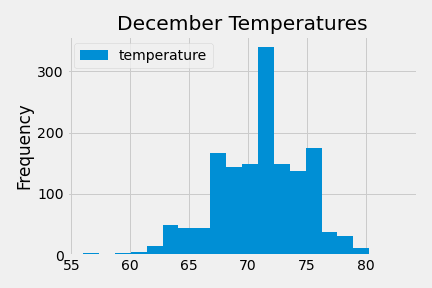
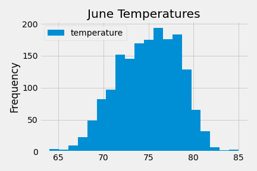
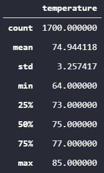
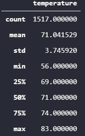

# surfs_up

## Overview

The purpose of this analysis is to explore the temperature data for June and December of all years contained in the .sqlite file.  We explore the temperature data in a winter month (December) compared to the temperature data in a summer month (June) to explore whether or not the surfboard and ice cream shop would be sustainable year round.

## Results

- Similar means

Despite the difference in season, Oahu is a very temperate, and this is clear from the data.  Below we display histograms for the temperature data in June and December.




As we can see, both distributions are quite normal, so we shouldn't expect wild variation in temperatures in either month.  December's mean temperature is 71 degrees and June's mean temperature is 75 degrees.

- Relatively small standard deviations
  
The images below summarize the statistics for both distributions.

June



December



As we suspected from viewing the histograms, both distributions have temperature standard deviations ranging from 3 to 4 degrees, which means the temperature ranges are tightly centered around the means; hence, according to historical data, the temperatures shouldn't vary wildly.

- Minimum temperatures

As one might expect, despite the temperate nature of the Oahu weather, the December minimum temperature is what one might deem "suboptimal ice cream weather."  However, when we look at the histogram for December, we see the frequency of temperatures in that bin is extremely low compared to the frequency of the warmer bins.

## Summary

We have seen the histograms and summary statistics for temperature data in both June and December, and we see both distributions closely resemble each other in most metrics.  The means and standard deviations are very similar, and both distributions are centered around "ideal ice cream and surfing weather."  However, there are more statistics we would like to see in order to determine whether or not the surf shop would be as successful in December as it might be in June.

- Precipitation Data
  
In addition to the temperatures, we should also investigate the precipitation data by month.  I'm no surfer, but I would expect surfing is less common during heavy rainfall, and this is likely the same for ice cream consumption.  We could query the data for precipitation much the same as we would the temperature data.

```
session.query(Measurement.date, Measurement.precipitation).filter(extract('month', Measurement.date)==XX).all()
```

Where `XX` denotes the month of interest as an integer ranging from 1 to 12.

- Tourism data

Whether or not the temperature and precipitation data are condusive to good conditions for surfing and ice cream, the winter data analysis may be a moot point if tourism drops drastically during the winter months.  We would like to see year-round tourism numbers so we may make a more informed decision on whether or not the business will still be successful during the off-season.  We don't have this data, but if we did, the structure of the query would mirror the previous query for the precipitation.